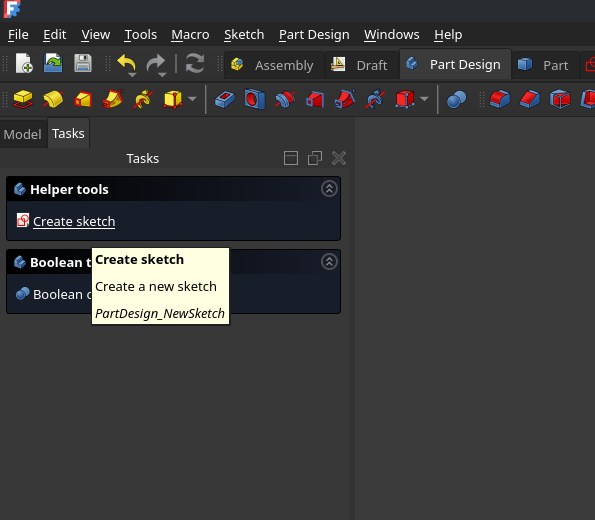
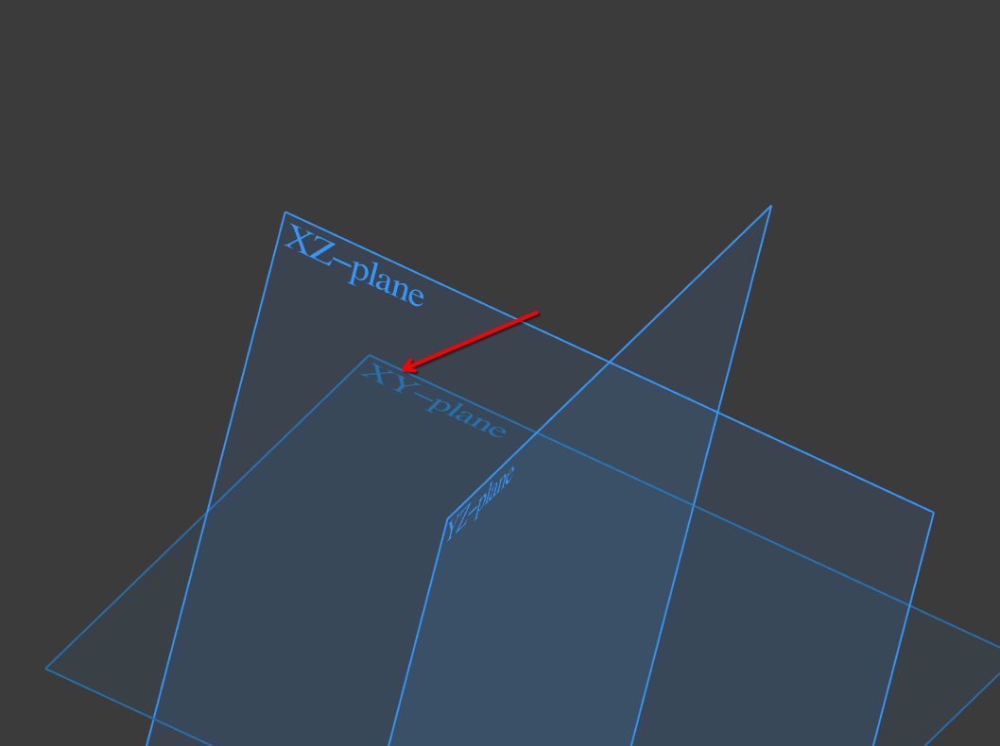
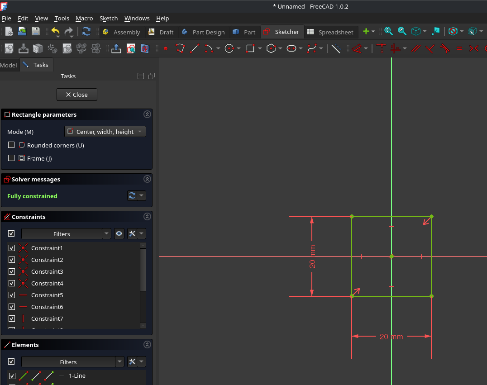
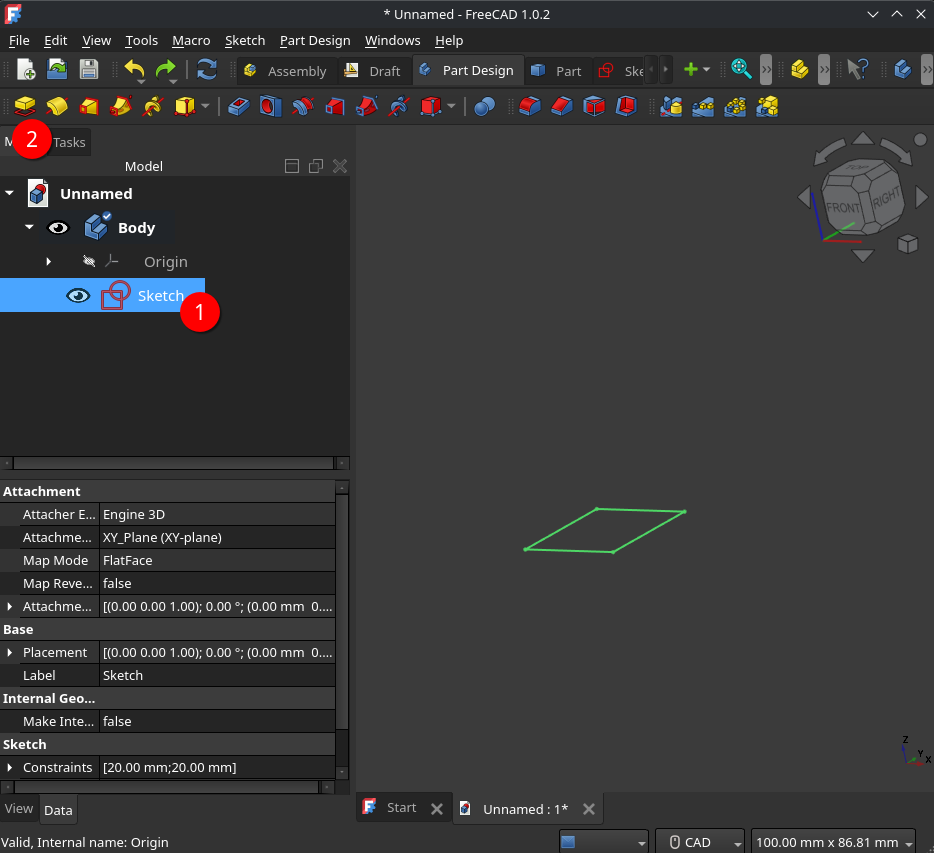
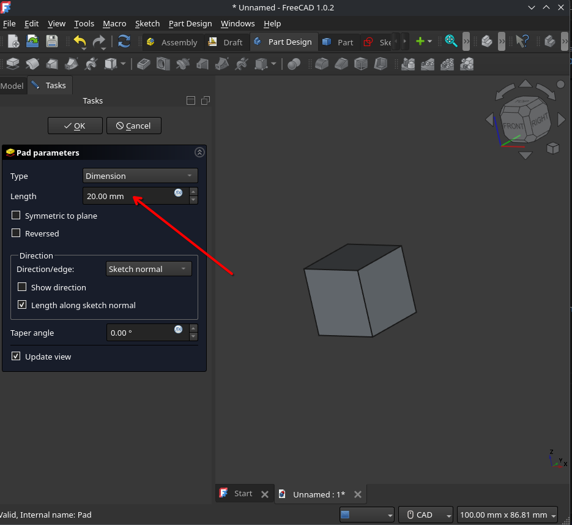

# FreeCAD workshop

## Khôi Tran 05.09.2025

---

## Presentation

https://puzzle.github.io/freecad-workshop

## Code

https://github.com/puzzle/freecad-workshop

## PDF

https://puzzle.github.io/freecad-workshop/PRESENTATION.pdf

## Markdown

https://puzzle.github.io/freecad-workshop/PRESENTATION.md

---

## Agenda

### Part 1

1. What is FreeCAD?
2. Compared to other 3D design applications
3. What is parametric CAD?
4. Simple FreeCAD workflow
5. Most important FreeCAD settings to get started
6. Learn as we go
   - Install FreeCAD
   - Use the Part Workbench to design a cube

---

### Part 2

1. Sketching
2. 3D oeprators
3. Creative time!
4. Tips and tricks

- Text
- Shapes

---

# What is FreeCAD

---

## What is CAD?

Computer-Assisted Design

🔑 Key Aspects of CAD:

- Parametric modeling: Define shapes with dimensions and constraints that can be updated later.
- 2D & 3D design: Supports both technical drawings (2D) and detailed 3D models.
- Accuracy: CAD models are mathematically precise, unlike hand sketches or artistic models.
- Documentation: CAD can generate technical drawings, assembly instructions, or manufacturing files.

---

## The dad-joke analogy

CAD: Excel for 3D-shapes

Blender: Painting or Sculpting with clay

Photoshop: Painting on canvas

---

## FEM - Finite Element Method

Simulate physical behavour of parts and structure under loads, heat, vibrations.

**FreeCAD has support for FEM.**

---

## CAM - Compuer-Aided Manufacturing

Generate machine instructions for manufacturing (CNC machines, G-code)

While FreeCAD has support, it is still recommended to use slicer software for 3D-printing.

---

## 🔍 Comparison: FreeCAD vs Similar Applications

| Feature / Tool          | **FreeCAD**                                              | **Fusion 360**                                       | **SolidWorks**                          | **Onshape**                           | **Blender** (3D Creation, not CAD-focused) |
| ----------------------- | -------------------------------------------------------- | ---------------------------------------------------- | --------------------------------------- | ------------------------------------- | ------------------------------------------ |
| **License / Cost**      | Free, Open Source (LGPL)                                 | Free hobbyist license, paid subscription for pro use | Paid (expensive, commercial)            | Subscription-based (cloud SaaS)       | Free (open source)                         |
| **Platform**            | Windows, macOS, Linux                                    | Windows, macOS (cloud-connected)                     | Windows only (VM workaround for Mac)    | Browser-based (any OS)                | Windows, macOS, Linux                      |
| **Parametric Modeling** | ✔️ Fully parametric                                      | ✔️ Fully parametric                                  | ✔️ Fully parametric                     | ✔️ Fully parametric                   | ❌ Not parametric (mesh-based)              |
| **Assembly Tools**      | Basic (Assembly workbenches, community add-ons)          | ✔️ Integrated assemblies                             | ✔️ Advanced assemblies                  | ✔️ Built-in assemblies                | ❌ No assembly workflow                     |
| **Ease of Learning**    | Moderate (engineer-oriented UI)                          | Beginner-friendly                                    | Moderate, steep curve for advanced      | Easy (intuitive, cloud-based)         | Steep curve, artist-focused                |
| **Community & Support** | Strong, open-source community                            | Large, official + community                          | Large professional support              | Growing community                     | Very large open-source community           |

---

# What is parametric CAD?

---

## Definition

Parametric CAD is about **rules & dimensions & relationships** that make your design adaptable and editable.

## What is it not?

- Not just drawing lines and shapes (like in Photoshop or Illustrator).
- Not digital sculpting where you push/pull clay (like in Blender).
- Not static models where every change means starting over.
- Not “locked” — you don’t have to redraw everything if you change a size.

---

## Examples of parametric modeling

### Specifying dimensions (parameters)

- The rectangle has width 50mm and height 40mm.
- The angle between line A and B is 30°
- The distance between the two lines is 60mm

### Specifying relationships (constraints)

- Line A must always be perpendicular to line B.
- Line C must always be the same length as Line D.
- Point E is point-symmetrical to Point F around Point G.

---

## Fully constrained

A fully constrained sketch means:

The geometry has exactly enough parameters and constraints
to define a geometry without having any degrees of freedom (DoFs).

FreeCAD checks your geometry for DoFs.

---

## Over constrained

There are redundant constraints in your geometry.

---

# Simple FreeCAD workflow for beginners

---

## Simple FreeCAD workflow

1. Create a sketch geometry
2. Make the sketch geometry fully constrained
3. Apply operators to your sketch

---

## DEMO

Simple FreeCAD workflow

---

# FreeCAD getting started - Learn as we go

---

## Install FreeCAD

### PopOS

`sudo apt install freecad`

### Arch

`yay install freecad`

### snap

`snap install freecad`

---

## Settings

### Units & Navigation style

Just use bottom right dropdown

### Available Workbenches

- Disable unneeded Workbenches, we focus today on:
  - Part Design
  - Sketch
  - Draft
- Workbench selector type: TabBar vs Dropdown

---

## Side-note notable workbenches

### Reverse Engineering

Reverse engineer `.STL` models to FreeCAD.

### Assembly

Assemble multiple parts to visualize mechanics / movement.

### Spreadsheet

Make a spreadsheet with editable data to edit your parts.

---

# Design a simple cube with FreeCAD

The parametric way

---

## Create a parametric part

---

## Create a sketch

---

## Select the XY plane

---

## Create a rectangle

Dimensions: 20mm x 20mm
Make the rectagle using **Center, width, height**

**And then close the sketch**

---

## Use your first operation: Pad

Select the sketch and then click on the **Pad** operator.

---

## Edit the Pad parameters

Set the *length* to **20mm**

Congrats! You made your first parametric part!

---

# End of first part! Let's have a break.