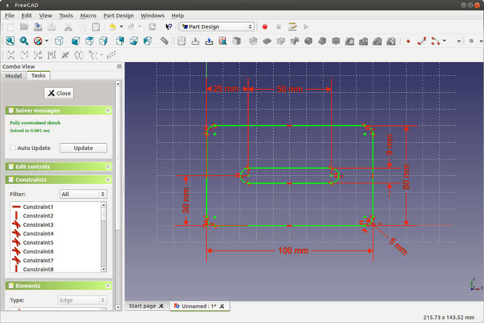
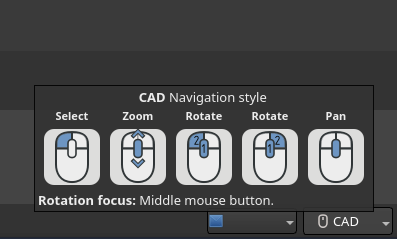
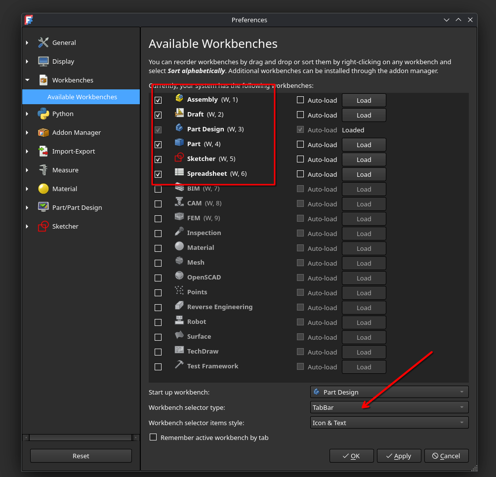
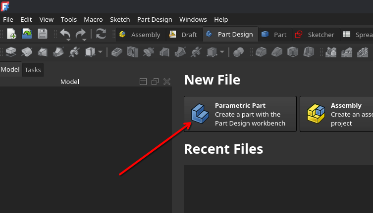

# FreeCAD workshop


## Khôi Tran 05.09.2025

---

## Presentation

- https://puzzle.github.io/freecad-workshop/?f=FREECAD_01.md
- https://puzzle.github.io/freecad-workshop/?f=FREECAD_02.md
- https://puzzle.github.io/freecad-workshop/?f=FREECAD_03.md

## Code

https://github.com/puzzle/freecad-workshop

## PDF
- [Part 01](https://puzzle.github.io/freecad-workshop/FREECAD_01.pdf)
- [Part 02](https://puzzle.github.io/freecad-workshop/FREECAD_02.pdf)
- [Part 03](https://puzzle.github.io/freecad-workshop/FREECAD_03.pdf)


---

## Agenda

### Part 1

1. What is **FreeCAD**?
2. Compared to other 3D design applications
3. What is **parametric CAD**?
4. Simple **FreeCAD workflow**
5. Most important **FreeCAD settings** to get started
6. Learn as we go
   - Install FreeCAD
   - Use the Part Workbench to design a parametric cube

---

### Part 2

1. 2D Sketching
2. 3D oeprators
3. Creative time!

---

### Part 3

Workflow from FreeCAD to 3D Printing.

---

# What is FreeCAD?

---

## What is CAD?

Computer-Assisted Design

🔑 Key Aspects of CAD:

- **Parametric modeling**: Define shapes with dimensions and constraints that can be updated later.
- **2D & 3D design**: Supports both technical drawings (2D) and detailed 3D models.
- **Accuracy**: CAD models are mathematically precise, unlike hand sketches or artistic models.
- **Documentation**: CAD can generate technical drawings, assembly instructions, or manufacturing files.

---

## The dad-joke analogy

**Photoshop**: Painting on canvas

**Blender**: Painting or Sculpting with clay

**CAD**: Excel for 3D-shapes

---

## FEM - Finite Element Method

Simulate physical behavour of parts and structure under loads, heat, vibrations.

**FreeCAD has support for FEM.**

---

## CAM - Compuer-Aided Manufacturing

Generate machine instructions for manufacturing (CNC machines, G-code)

While FreeCAD has support, it is still recommended to use slicer software for 3D-printing.

- Cura
- PrusaSlicer
- SuperSlicer

---

## 🔍 Comparison: FreeCAD vs Similar Applications

| Feature / Tool          | **FreeCAD**                                              | **Fusion 360**                                       | **SolidWorks**                          | **Onshape**                           | **Blender** (3D Creation, not CAD-focused) |
| ----------------------- | -------------------------------------------------------- | ---------------------------------------------------- | --------------------------------------- | ------------------------------------- | ------------------------------------------ |
| **License / Cost**      | Free, Open Source (LGPL)                                 | Free hobbyist license, paid subscription for pro use | Paid (expensive, commercial)            | Subscription-based (cloud SaaS)       | Free (open source)                         |
| **Platform**            | Windows, macOS, Linux                                    | Windows, macOS (cloud-connected)                     | Windows only (VM workaround for Mac)    | Browser-based (any OS)                | Windows, macOS, Linux                      |
| **Parametric Modeling** | ✔️ Fully parametric                                      | ✔️ Fully parametric                                  | ✔️ Fully parametric                     | ✔️ Fully parametric                   | ❌ Not parametric (mesh-based)              |
| **Assembly Tools**      | Basic (Assembly workbenches, community add-ons)          | ✔️ Integrated assemblies                             | ✔️ Advanced assemblies                  | ✔️ Built-in assemblies                | ❌ No assembly workflow                     |
| **Ease of Learning**    | Moderate (engineer-oriented UI)                          | Beginner-friendly                                    | Moderate, steep curve for advanced      | Easy (intuitive, cloud-based)         | Steep curve, artist-focused                |
| **Community & Support** | Strong, open-source community                            | Large, official + community                          | Large professional support              | Growing community                     | Very large open-source community           |

---

# What is parametric CAD?

---

## Definition

Parametric CAD is about **rules & dimensions & relationships** that make your design adaptable and editable.



---

## Examples of parametric modeling

### Specifying dimensions (parameters)

- The rectangle has width 50mm and height 40mm.
- The angle between line A and B is 30°
- The distance between the two lines is 60mm

### Specifying relationships (constraints)

- Line A must always be perpendicular to line B.
- Line C must always be the same length as Line D.
- Point E is point-symmetrical to Point F around Point G.

---

## Fully constrained

A fully constrained sketch means:

The geometry has exactly enough parameters and constraints
to define a geometry without having any degrees of freedom (DoFs).

FreeCAD checks your geometry for DoFs.

---

# Simple FreeCAD workflow for beginners

---

<!-- {"animate-li": true} -->

## Simple FreeCAD workflow

1. Create a sketch geometry
2. (optional but recommended) Make the sketch geometry fully constrained
3. Apply operators to your sketch

---

## DEMO

Simple FreeCAD workflow

---

# FreeCAD getting started

---

## Install FreeCAD

### PopOS

```
sudo apt install freecad
```

### Arch

```
yay install freecad
```


### snap

```
snap install freecad
```

### flatpak
```
flatpak install org.freecad.FreeCAD
```

---

## Settings

### Units & Navigation style

Just use bottom right dropdown



---

### Available Workbenches

*Edit --> Preferences --> Available Workbenches*



- Disable unneeded Workbenches, we focus today on:
  - Part Design
  - Sketcher
  - Draft
- Workbench selector type: TabBar vs Dropdown

---

## Side-note notable workbenches

### Reverse Engineering

Reverse engineer `.STL` models to FreeCAD.

### Assembly

Assemble multiple parts to visualize mechanics / movement.

### Spreadsheet

Make a spreadsheet with editable data to edit your parts.

---

# Design a simple cube with FreeCAD

The parametric way

---

## Create a parametric part



---

## Create a sketch

See tasks


---

## Select the XY plane


---

## Create a rectangle

Dimensions: **20mm x 20mm**
Make the rectagle using **Center, width, height**


**And then close the sketch**

---

## Use your first operation: Pad

Select the sketch and then click on the **Pad** operator.


---

## Edit the Pad parameters

Set the *length* to **20mm**


Congrats! You made your first parametric part!

---

# End of first part! Let's have a break.