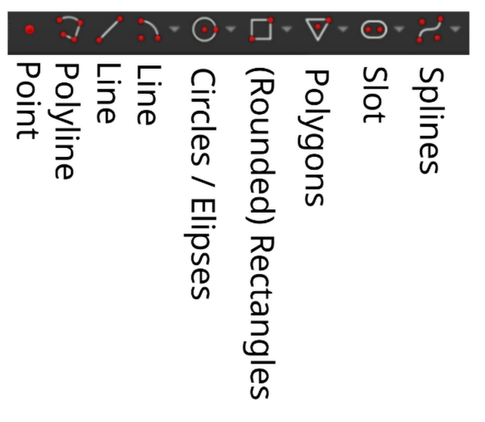

# FreeCAD workshop - Part 2

---

# 2D sketching

---

## FreeCAD sketches

Can be created on:
- The 3 base planes (XY, XZ, YZ)
- On flat surfaces of solids

---

## Sketch fully constrained?

Goal in sketching - make your sketch green!

---

## Create primitives

They are straightforward to use,
don't forget to explore the creation parameters!

---

## Create constraints

Your best friend: `D` Key (Dimension tool)

---

## Import geometry

Allows you to import geometry from other sketches and solids to use for constraints.

Example: *Drill a hole, 10mm from the edge of the box.*

---

# 3D Operators

---

## Sketch to solid operators

- **Pad**: Extrude a sketch
- **Revolve**: Rotate a sketch around an axis
- **Loft**: Extrude using multiple sketches
- **Pipe**: Make a sketch follow a path

---

## Solid operators

- **Pocket**: Cut into a solid using a sketch
- **Hole**: Make a standard (threaded-)hole
- **Fillet**: Round edges
- **Chamfer**: Cut an edge at a straight angle
- **Thickness**: Make a solid *hollow*

---

## Duplicate operators
- Linear Pattern
- Polar Pattern

---

# Sketch operators

---

## Pad / "Aufpolsterung"

---

## Revolve / Drehteil

---

## Loft / Ausformung

---

## Pipe / Rohr

---

# Solid operators

---

## Thickness / "Dicke"

---

## Pocket / Vertiefung

---

## Hole / Loch

---

## Fillet / Verrundung

---

## Chamfer / Fase

---

## Linear Pattern

---

## Polar Pattern

---

# Creative time!

Try to create something with what we've learned!

---

## Still no ideas?

## The cup

---

## Ball labyrinth

---

## Meme toy

---

## A simple table

---

# DEMO - 2D Shapes and Text