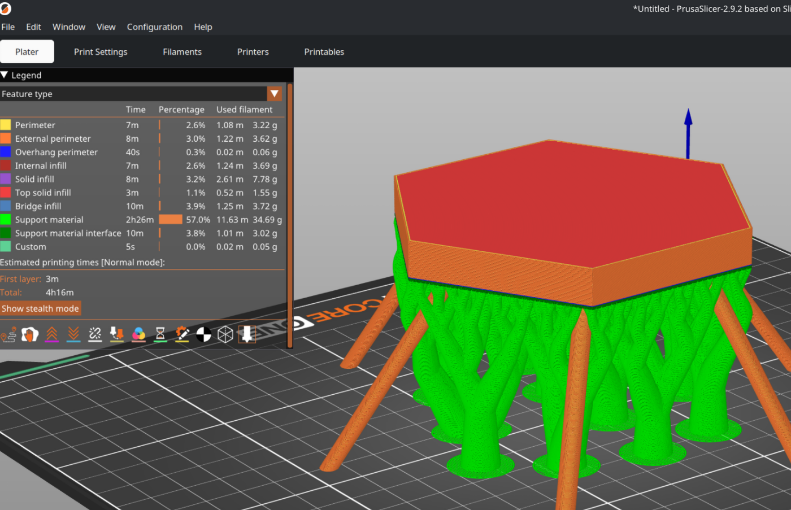
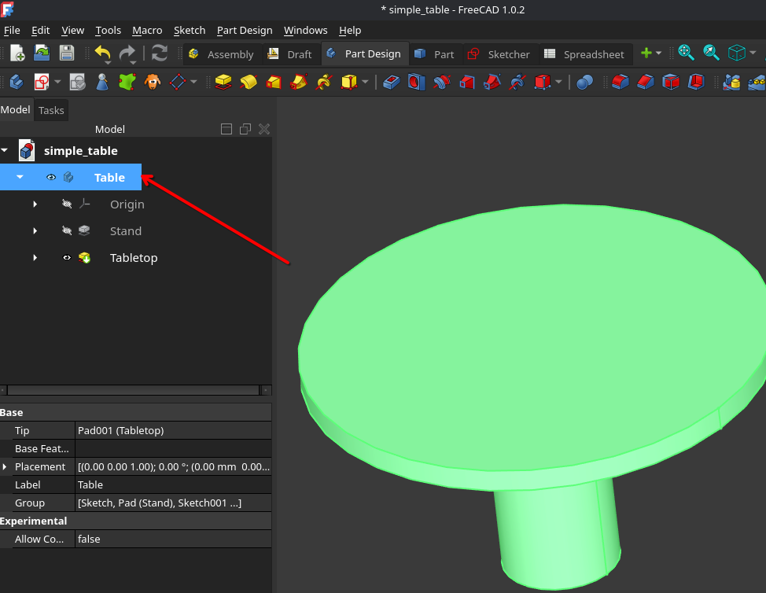
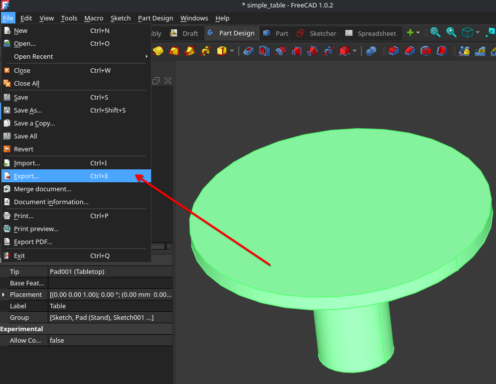
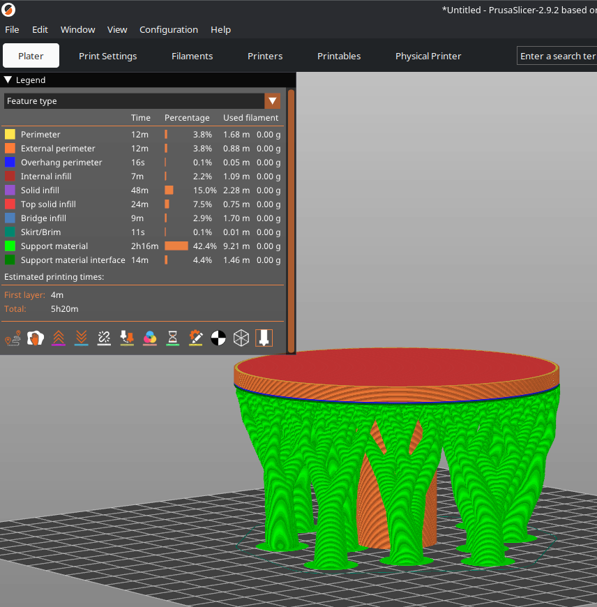

# FreeCAD workshop - Part 3
## 3D Print your objects

---

## 3D Printing Workflow

### Select at least one body

---

### Export to STL or 3MF

---

### Load into your slicer application

Example using PrusaSlicer

---

## What are the core parts?

- .STL File: 3D mesh of your object
- Slicer application
   - Allows for last-minute customizations (print multiples, scaling)
   - Add support structures
   - Optimizes the mesh for your 3D-printer (filament, nozzle size, etc.)
   - Converts your 3D mesh to G-code

---

## Thanks!

---

# Bonus content (improvised)

- Text and fonts
- Reverse engineering with picture
- Curves Addon
